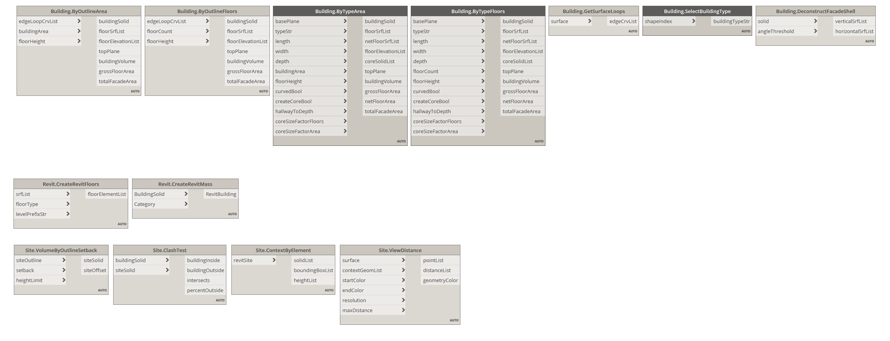
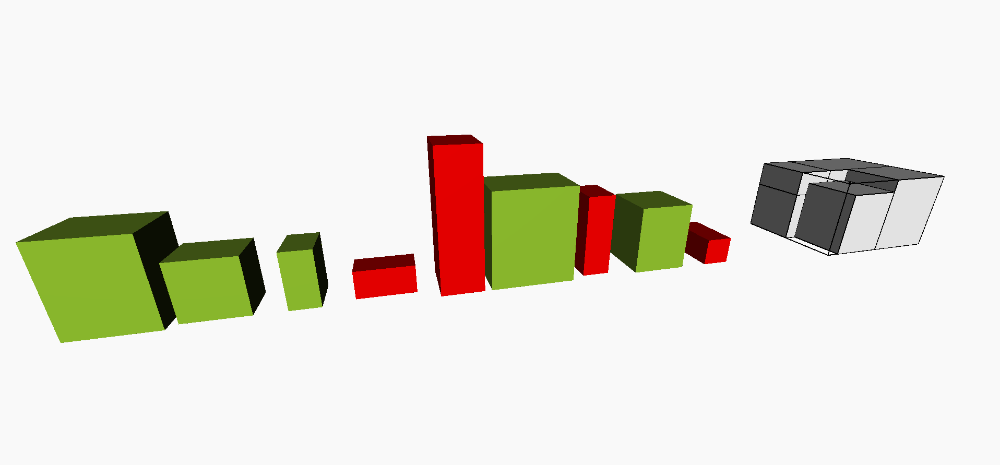
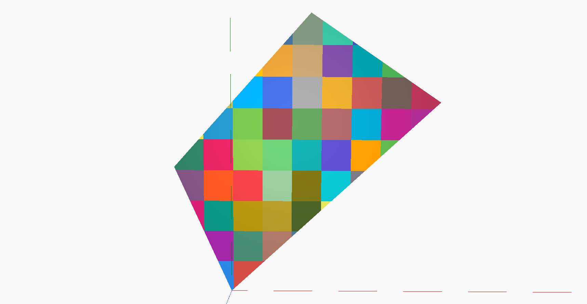
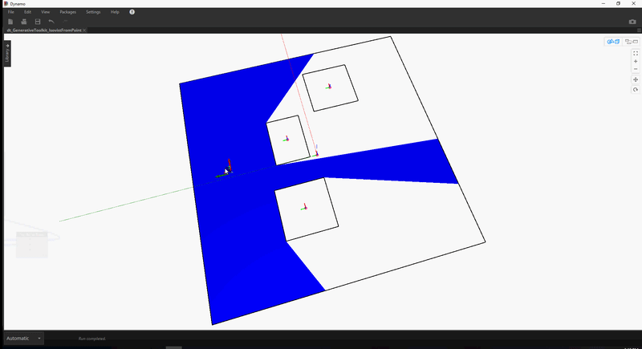
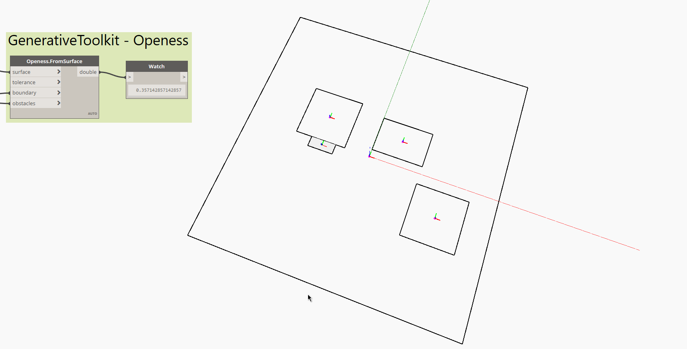
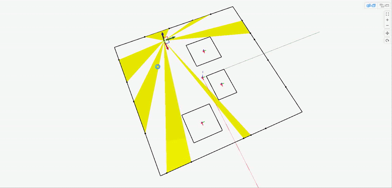
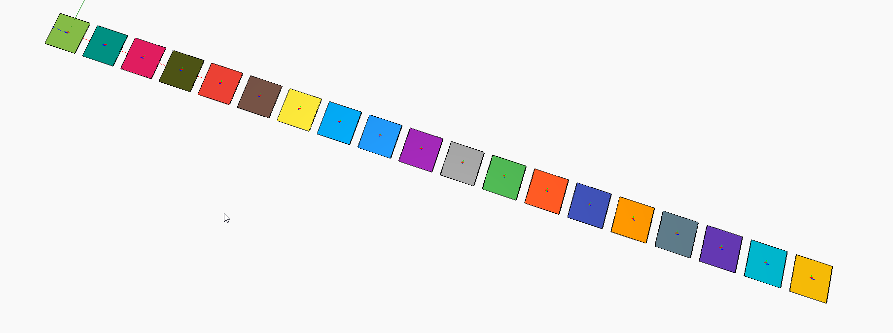

# Refinery Toolkits

A collection of packages to accelerate generative design workflows in [Dynamo](http://www.dynamobim.org) & [Refinery](https://www.autodesk.com/solutions/refinery-beta).

# The toolkits
There are currently 2 packages included in the toolkit, each focusing on enabling specific types of workflows:
- SpacePlanning Toolkit
- Massing Toolkit

## Space Planning Toolkit
The toolkit offers a range of nodes that help with general space-planning workflows in Dynamo and Revit.  


## Massing Toolkit
optimization & design option generation


# Getting Started

## Installation
The toolkits are not yet available on the Dynamo Package Manager. You can install them manually by following the instructions under the [Alternative installation methods](#alternative-installation-methods) section at the end of this document. 

# Using the toolkits
This repository has quite a few sample files provided to help you get started with each of the toolkits. 

It is highly recommed starting with the samples as they contain detailed notes and instructions on how to use each of the nodes. 
Feel free to open an issue or submit a PR if you'd like to see further some documentation added here.

## Samples
There are 11 sample Dynamo graphs included with the __SpacePlanningToolkit__ package, all made to work with  Dynamo `2.0`.

You can find the samples in this repository's [`samples folder`](https://github.com/DynamoDS/RefineryToolkits/tree/master/samples) folder, as well as and in the `extra` folder of the package you download using the Dynamo Package Manager, typically found here : `%appdata%\Dynamo\Dynamo Revit\2\packages\GenerativeToolkit`

The samples shows a simple example of how each node in the toolkit works. Some of the samples will have a Revit version (marked with __(RVT)__), and some also have a version setup to be used with Refinery (marked with __(RefineryVersion)__) :

#### Sample 1 - AllNodes
Index graph showing all available nodes in the GenerativeToolkit packages.

#### Sample 2 - GenerativeToolkit_Binpacking2D
The sample folder contains 3 different graphs showing different ways to use the Binpacking2D nodes. The binpacking 2D nodes requriers 3 inputs, a list of rectangles to pack, a single Rectangle to pack into and a placement method. There are 3 different placement methods in the package:
- _Best Shortest Side Fits_ - Will pack the rectangle into the free area where it minimizes the length of the areas shortest side.
- _Best Longest Side Fits_ - Will pack the rectangle into the free area where it minimizes the length of the areas longest side.
- _Best Area Fits_ - Will pack the rectangle into the free area where the remaining area after the placement is minimized.

There are 3 different sample workflows in the sample folder:
- _GenerativeToolkit_Binpacking2DTest_BAF_ show the result of packing rectangles with the Best Area Fits placement method, and different ways of sorting the rectangles to pack.
- _GenerativeToolkit_Binpacking2DTest_BLSF_ show the result of packing rectangles with the Best Long Side Fits placement method, and different ways of sorting the rectangles to pack.
- _GenerativeToolkit_Binpacking2DTest_BSSF_ show the result of packing rectangles with the Best Short Side Fits placement method, and different ways of sorting the rectangles to pack.


#### Sample 3 - GenerativeToolkit_Binpacking3DTest
This sample shows how the Binpacking3D node works. The node requires a Bin as a Cuboid and a list of Items also as Cuboids. The node will take the items and pack as many as possible into the Bin Cuboid.
The sample displays the final pack and will also show which items has been packed (green cuboids) and which items hasn't (red cuboids). 




#### Sample 4 - GenerativeToolkit_SurfaceDivisionTest
The SurfaceDivision node will take any Surface and divided it based on U and V parameters.



#### Sample 5 - GenerativeToolkit_GeometricMedianTest
The GeometricMedian node takes a list of sample point and finds the point that minimizes the distance to all other points. In the sample file 5 different examples are shown. 


#### Sample 6 - GenerativeToolkit_IsovistFromPointTest 
The Isovist.FromPoint node takes a boundary polygon, internal polygons and a origin point and calculates the visible area from that point.



#### Sample 7 - GenerativeToolkit_OpenessTest
The Openess node takes a boundary polygon, obstacle polygons and a Surface and calculates how much of the surface perimeter is enclosed by a obstacle.

The sample folder contains 2 versions of this sample, a Sandbox version and a Revit version.



#### Sample 8 - GenerativeToolkit_ShortestPath
The Shortest Path node will calculate the path between two points with the minimum distance.


#### Sample 9 - GenerativeToolkit_ViewsToOutsideTest
Views to Outside will calculate in precentage how much views to outside there is from a origin point. Views to outside is represented by line segments. 

The sample folder contains 3 versions of this sample, a Sandbox version, a Revit version and a version set up to be used in Refinery.




#### Sample 10 - GenerativeToolkit_VisiblePointsTest
Visible Points calculates the amount of visible points from a origin point. The points can represent what ever you want them to be, it could be "how much of this space (represented by points) is visible form this point" or "How many other desks (represented with points) are visible from this point".

The sample folder contains 2 versions of this sample, a Sandbox version and a version set up to be used in Refinery.


#### Sample 11 - GenerativeToolkit_DistinctColorsTest
The ContrastyColorRange node returns a given amount of colors in a random order which all are visually distinct from each other.
The maximum colors that can be created right now is 19.



## Structure
The __GenerativeToolkit__ is organized in 4 categories, based on their use in a Generative Design process :
- `Generate` : In this category you can find nodes to help generate design options.
- `Analyse` : The designs generated in the previous step can now be measured, or analyzed on how well they achieve goals defined by the designer. This category contains nodes to help with that.
- `Rank` : Based on the results of the analysis, design options can be ordered or ranked. This category has nodes for that.
- `Explore` : In Explore, nodes that helps visualize result are placed. 


## Alternative installation methods

### Manual install
If you prefer to install one of the more experimental/work-in-progress builds, you can still follow the instructions below.

- Download the latest release from the [Releases page](https://github.com/DynamoDS/RefineryToolkits/releases)
- unzip the downloaded file, we recommend using [7zip](https://www.7-zip.org/download.html)
- once unzipped, double-check that all `.dll` files in the package's `bin` folder have been [unblocked](https://blogs.msdn.microsoft.com/delay/p/unblockingdownloadedfile/)
- copy the package folder to the location of your Dynamo packages  :
    - `%appdata%\Dynamo\Dynamo Core\2\packages` for Dynamo Sandbox, replacing `2` with your version of Dynamo
    - `%appdata%\Dynamo\Dynamo Revit\2\packages` for Dynamo for Revit, replacing `2` with your version of Dynamo
- start Dynamo, the package should now be listed as in the library and in Dynamo's `Package Manager`


## Prerequisites

This project requires the following applications or libraries be installed :

```
Dynamo : version 2.1 or later
```
```
.NET : version 4.7 or later
```

Please note the project has no dependency to Revit and its APIs, so it will happily run in Dynamo Sandbox or Dynamo Studio.

## Contributing
Please read [CONTRIBUTING.md](https://github.com/DynamoDS/RefineryToolkits/tree/master/docs/CONTRIBUTING.md) for details on how to contribute to this package. Please also read the [CODE OF CONDUCT.md](https://github.com/DynamoDS/RefineryToolkits/tree/master/docs/CODE_OF_CONDUCT.md).

## Authors

__Sylvester Knudsen__ : [Github profile](https://github.com/SHKnudsen), [Twitter profile](https://twitter.com/SHKnudsen)

## Licensing

This project is licensed under the Apache 2.0 License - see the [LICENSE FILE](https://github.com/DynamoDS/RefineryToolkits/tree/master/LICENSE) for details.

### Packages used
[Graphical](https://github.com/alvpickmans/Graphical)

[MIConvexHull](https://github.com/DesignEngrLab/MIConvexHull)

[3DContainerPacking](https://github.com/davidmchapman/3DContainerPacking)
