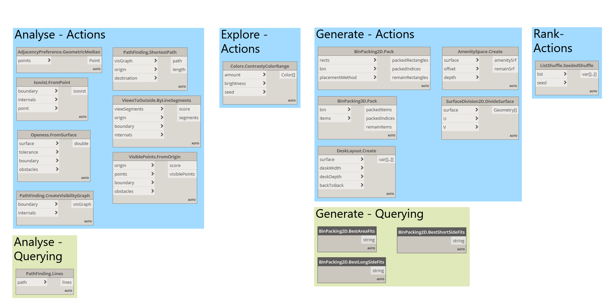

# Refinery Toolkits

A collection of packages to accelerate generative design workflows in [Dynamo](http://www.dynamobim.org) & [Refinery](https://www.autodesk.com/solutions/refinery-beta).

# The toolkits
There are currently 2 packages included in the toolkit, each focusing on enabling specific types of workflows:
- SpacePlanning Toolkit
- Massing Toolkit

## Space Planning Toolkit
The toolkit offers a range of nodes that help with general space-planning workflows in Dynamo and Revit.  


[For more information on the SpacePlanningToolkit](src/SpacePlanning/README)

## Massing Toolkit
optimization & design option generation


[For more information on the MassingToolkit](src/MassingSandbox/README)

[For more information on the MassingToolkit for Revit](src/MassingRevit/README)

# Getting Started

## Installation
The toolkits are not yet available on the Dynamo Package Manager. You can install them manually by following the instructions under the [Alternative installation methods](#alternative-installation-methods) section at the end of this document. 

# Using the toolkits
This repository has quite a few sample files provided to help you get started with each of the toolkits. 

It is highly recommed starting with the samples as they contain detailed notes and instructions on how to use each of the nodes. 
Feel free to open an issue or submit a PR if you'd like to see further some documentation added here.

You can find the samples in this repository's [`samples folder`](https://github.com/DynamoDS/RefineryToolkits/tree/master/samples) folder, as well as and in the `extra` folder of the package you download using the Dynamo Package Manager, typically found here : `%appdata%\Dynamo\Dynamo Revit\2\packages\GenerativeToolkit`

The samples shows a simple example of how each node in the toolkit works. Some of the samples will have a Revit version (marked with __(RVT)__), and some also have a version setup to be used with Refinery (marked with __(RefineryVersion)__) :

## Structure
The __RefineryToolkits__ is organized in 4 categories, based on their use in a Generative Design process :
- `Generate` : In this category you can find nodes to help generate design options.
- `Analyse` : The designs generated in the previous step can now be measured, or analyzed on how well they achieve goals defined by the designer. This category contains nodes to help with that.
- `Rank` : Based on the results of the analysis, design options can be ordered or ranked. This category has nodes for that.
- `Explore` : In Explore, nodes that helps visualize result are placed. 


## Alternative installation methods

### Manual install
If you prefer to install one of the more experimental/work-in-progress builds, you can still follow the instructions below.

- Download the latest release from the [Releases page](https://github.com/DynamoDS/RefineryToolkits/releases)
- unzip the downloaded file, we recommend using [7zip](https://www.7-zip.org/download.html)
- once unzipped, double-check that all `.dll` files in the package's `bin` folder have been [unblocked](https://blogs.msdn.microsoft.com/delay/p/unblockingdownloadedfile/)
- copy the package folder to the location of your Dynamo packages  :
    - `%appdata%\Dynamo\Dynamo Core\2\packages` for Dynamo Sandbox, replacing `2` with your version of Dynamo
    - `%appdata%\Dynamo\Dynamo Revit\2\packages` for Dynamo for Revit, replacing `2` with your version of Dynamo
- start Dynamo, the package should now be listed as in the library and in Dynamo's `Package Manager`


## Prerequisites

This project requires the following applications or libraries be installed :

```
Dynamo : version 2.1 or later
```
```
.NET : version 4.7 or later
```

Please note that only project has no dependency to Revit and its APIs, so it will happily run in Dynamo Sandbox or Dynamo Studio.

## Contributing
Please read [CONTRIBUTING.md](https://github.com/DynamoDS/RefineryToolkits/tree/master/docs/CONTRIBUTING.md) for details on how to contribute to this package. Please also read the [CODE OF CONDUCT.md](https://github.com/DynamoDS/RefineryToolkits/tree/master/docs/CODE_OF_CONDUCT.md).

## Licensing

This project is licensed under the Apache 2.0 License - see the [LICENSE FILE](https://github.com/DynamoDS/RefineryToolkits/tree/master/LICENSE) for details.

We do our best comply with all license conditions and restrictions, so please let us know if you have any questions or spot anything out of order.
