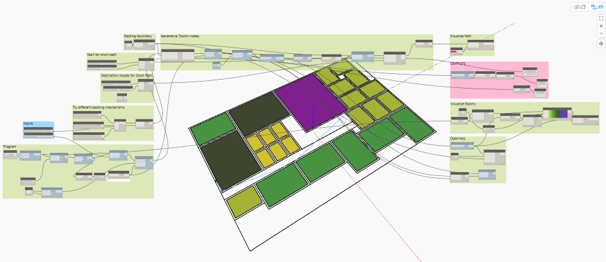
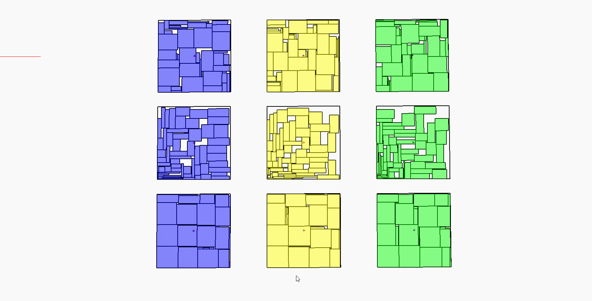
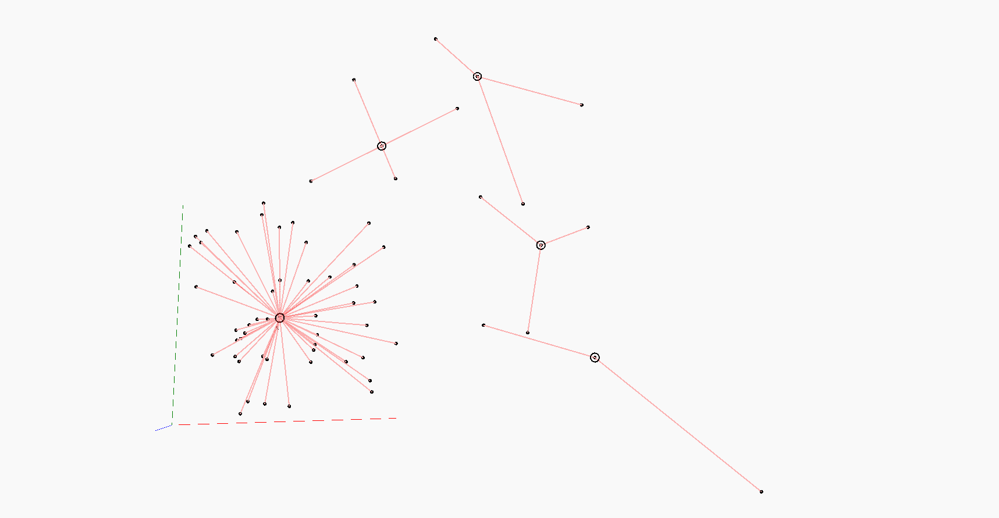
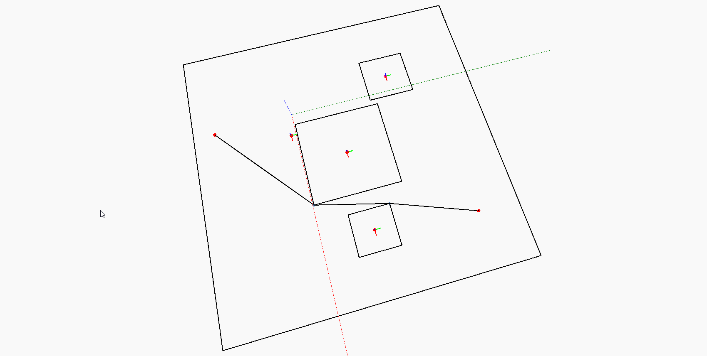
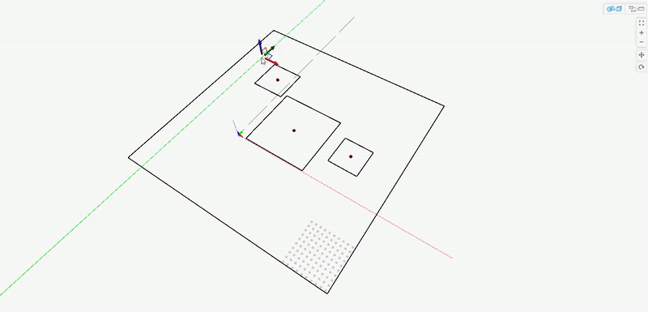

# SpacePlanning Toolkit

A collection of node to accelerate generative space planning workflows in [Dynamo](http://www.dynamobim.org) & [Refinery](https://www.autodesk.com/solutions/refinery-beta). This toolkit will run in both DynamoSandbox, DynamoStudio and Dynamo4Revit.

## Samples
There are 11 sample Dynamo graphs included with the __SpacePlanningToolkit__ package, all made to work with  Dynamo `2.0`.

#### Sample 1 - AllNodes
Index graph showing all available nodes in the GenerativeToolkit packages.

#### Sample 2 - GenerativeToolkit_Binpacking2D
The sample folder contains 3 different graphs showing different ways to use the Binpacking2D nodes. The binpacking 2D nodes requriers 3 inputs, a list of rectangles to pack, a single Rectangle to pack into and a placement method. There are 3 different placement methods in the package:
- _Best Shortest Side Fits_ - Will pack the rectangle into the free area where it minimizes the length of the areas shortest side.
- _Best Longest Side Fits_ - Will pack the rectangle into the free area where it minimizes the length of the areas longest side.
- _Best Area Fits_ - Will pack the rectangle into the free area where the remaining area after the placement is minimized.

There are 3 different sample workflows in the sample folder:
- _GenerativeToolkit_Binpacking2DTest_BAF_ show the result of packing rectangles with the Best Area Fits placement method, and different ways of sorting the rectangles to pack.
- _GenerativeToolkit_Binpacking2DTest_BLSF_ show the result of packing rectangles with the Best Long Side Fits placement method, and different ways of sorting the rectangles to pack.
- _GenerativeToolkit_Binpacking2DTest_BSSF_ show the result of packing rectangles with the Best Short Side Fits placement method, and different ways of sorting the rectangles to pack.

#### Sample 3 - GenerativeToolkit_Binpacking3DTest
This sample shows how the Binpacking3D node works. The node requires a Bin as a Cuboid and a list of Items also as Cuboids. The node will take the items and pack as many as possible into the Bin Cuboid.
The sample displays the final pack and will also show which items has been packed (green cuboids) and which items hasn't (red cuboids). 

#### Sample 4 - GenerativeToolkit_SurfaceDivisionTest
The SurfaceDivision node will take any Surface and divided it based on U and V parameters.

#### Sample 5 - GenerativeToolkit_GeometricMedianTest
The GeometricMedian node takes a list of sample point and finds the point that minimizes the distance to all other points. In the sample file 5 different examples are shown. 

#### Sample 6 - GenerativeToolkit_IsovistFromPointTest 
The Isovist.FromPoint node takes a boundary polygon, internal polygons and a origin point and calculates the visible area from that point.

#### Sample 7 - GenerativeToolkit_OpenessTest
The Openess node takes a boundary polygon, obstacle polygons and a Surface and calculates how much of the surface perimeter is enclosed by a obstacle.

The sample folder contains 2 versions of this sample, a Sandbox version and a Revit version.

#### Sample 8 - GenerativeToolkit_ShortestPath
The Shortest Path node will calculate the path between two points with the minimum distance.

#### Sample 9 - GenerativeToolkit_ViewsToOutsideTest
Views to Outside will calculate in precentage how much views to outside there is from a origin point. Views to outside is represented by line segments. 

The sample folder contains 3 versions of this sample, a Sandbox version, a Revit version and a version set up to be used in Refinery.

#### Sample 10 - GenerativeToolkit_VisiblePointsTest
Visible Points calculates the amount of visible points from a origin point. The points can represent what ever you want them to be, it could be "how much of this space (represented by points) is visible form this point" or "How many other desks (represented with points) are visible from this point".

The sample folder contains 2 versions of this sample, a Sandbox version and a version set up to be used in Refinery.

#### Sample 11 - GenerativeToolkit_DistinctColorsTest
The ContrastyColorRange node returns a given amount of colors in a random order which all are visually distinct from each other.
The maximum colors that can be created right now is 19.

### Packages used

This project uses the third-party packages listed below, whose licenses are available in the [docs](https://github.com/DynamoDS/RefineryToolkits/tree/master/docs) folder as per their MIT license requirements.

- [Graphical](https://github.com/alvpickmans/Graphical)
- [MIConvexHull](https://github.com/DesignEngrLab/MIConvexHull)
- [3DContainerPacking](https://github.com/davidmchapman/3DContainerPacking)